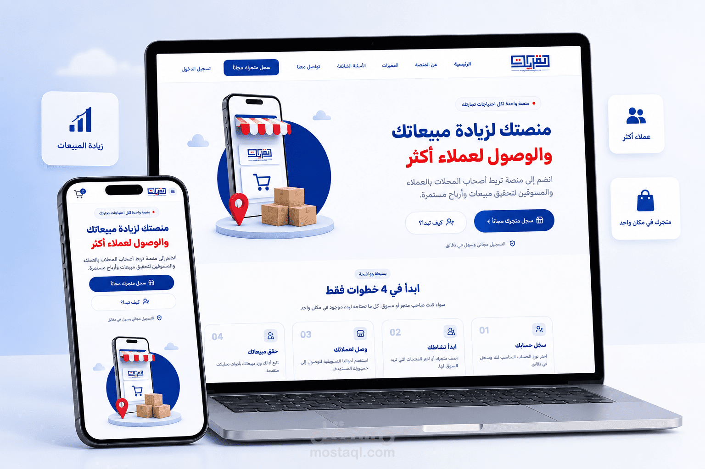

# Full Stack Developer

Building modern, scalable web applications with clean architecture,
responsive interfaces, and production-ready technologies.

 

---

## 👩‍💻 About Me

I'm a **Full Stack Developer** passionate about building modern web applications
and transforming ideas into real-world digital products.

I focus on creating:

- Scalable web applications
- Responsive and modern user interfaces
- Clean and maintainable code
- RESTful APIs
- Secure authentication systems
- Performance-focused applications
- Real-world client projects

My main ecosystem is **JavaScript / TypeScript**, with experience across
both frontend and backend development.

---

# 🛠️ Tech Stack

### Frontend

### Backend & Database

### Tools

---

# 🚀 Featured Projects

---

## 🛒 Qurayyat Market

### Client Landing Page

A modern and responsive **client landing page** built with
**Next.js and Tailwind CSS**, focusing on clean UI, responsive layouts,
performance, and a smooth user experience.

The project was developed as a real-world client project and deployed
to production using Vercel.

### Highlights

- Real-world client project
- Modern responsive design
- Mobile-first approach
- Clean component architecture
- Reusable UI sections
- Responsive layouts across devices
- Performance-focused implementation
- Modern visual hierarchy
- Conversion-oriented layout
- Production deployment

### Technology

- Next.js
- React
- TypeScript
- Tailwind CSS
- Responsive Design
- Vercel

### Project

🌐 **Live Website**

https://qurayyat-market.vercel.app/

> **Client Project — Repository Private**

---

## 🩺 Al-Shifa Clinic

### Full-Stack Healthcare Platform

A full-stack healthcare platform designed to streamline medical services
through appointment management, doctor profiles, video consultations,
electronic prescriptions, multilingual support, and secure authentication.

### Key Features

- Multi-role Authentication
  - Patient
  - Doctor
  - Admin
- Appointment Booking System
- Real-Time Video Consultations
- Electronic Prescriptions
- Doctor Ratings & Reviews
- Arabic & English Support
- Stripe Payment Integration
- Admin Dashboard
- Responsive Design

### Technology

**Frontend**

- React
- TypeScript
- Tailwind CSS
- React Query
- i18next

**Backend**

- Node.js
- Express.js
- TypeScript
- MongoDB
- Socket.io
- JWT Authentication

**Services**

- Stripe
- Cloudinary
- Mailtrap
- ZegoCloud

### Project

🌐 **Live Demo**

https://al-shifa-clinic.vercel.app/

📂 **Repository**

https://github.com/Esraa-Dev/Al-Shifa-Clinic

---

## 🕌 Ataa Platform

### Full-Stack Islamic Educational Platform

A modern full-stack platform developed to provide an engaging Islamic
educational experience with responsive UI, authentication, dynamic content,
and scalable architecture.

### Highlights

- Modern responsive interface
- Authentication system
- Dynamic content management
- Optimized performance
- Clean component architecture
- Scalable application structure

### Technology

- React
- TypeScript
- Next.js
- Tailwind CSS
- Node.js
- MongoDB

### Project

🌐 **Live Demo**

https://ataa-omega.vercel.app/

> **Repository — Private**

---

## 💻 Tarmeez Code

### Programming Education Platform

A professional educational platform focused on programming education,
with a modern user experience, responsive design, and high-performance
frontend architecture.

### Highlights

- Responsive modern UI
- Interactive user experience
- Fast performance
- Production-ready frontend
- Clean component architecture
- Responsive layouts

### Technology

- React
- TypeScript
- Next.js
- Tailwind CSS
- React Query

### Project

🌐 **Live Website**

https://tarmeezcode.com/

> **Repository — Private**

---

# 💻 Technologies I Work With

| Frontend | Backend | Database | Tools |
|----------|----------|----------|-------|
| React | Node.js | MongoDB | Git |
| Next.js | Express.js | MySQL | GitHub |
| TypeScript | REST APIs | Prisma | Postman |
| JavaScript | JWT | Mongoose | Figma |
| Tailwind CSS | Socket.io | | VS Code |
| Bootstrap | | | React Query |
| Redux Toolkit | | | |

---

# 🎯 What I Build

| 🌐 Web Applications | 🛒 E-Commerce | 🩺 Healthcare Platforms |
|:---:|:---:|:---:|
| Modern & Responsive | Conversion Focused | Scalable Architecture |

| ⚛️ React Applications | 🚀 Next.js Projects | 🔧 REST APIs |
|:---:|:---:|:---:|
| Component-Based | SEO & Performance | Secure & Maintainable |

---

# 🌐 Connect With Me

 

