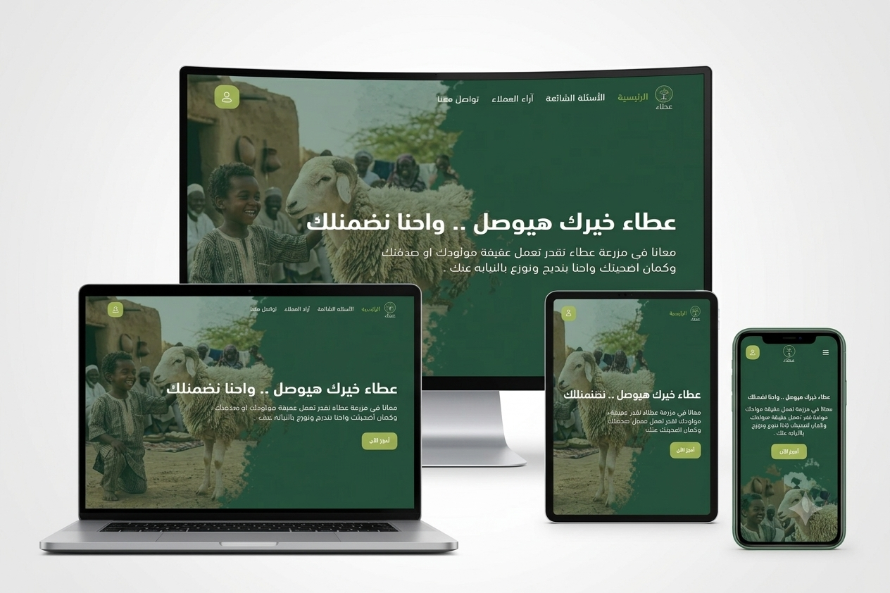
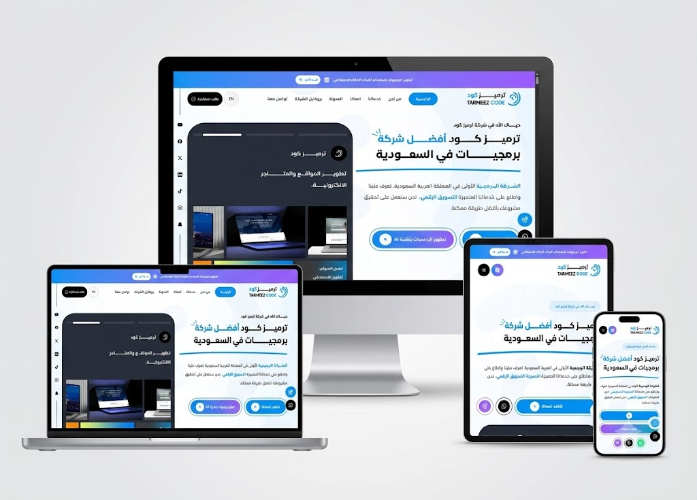

# Full Stack Developer

Building scalable web applications with modern technologies and clean architecture.

 

---

## 👩‍💻 About Me

I'm a Full Stack Developer passionate about building modern web applications and transforming ideas into real-world digital products.

My focus is creating scalable systems, responsive user interfaces, and maintainable backend architectures using modern JavaScript technologies.

---

## 🛠️ Tech Stack

---

# 🚀 Featured Projects

---

## 🩺 Al-Shifa Clinic

A full-stack healthcare platform built to streamline medical services through appointment management, doctor profiles, video consultations, multilingual support, and secure authentication.

### Key Features

- Multi-role Authentication (Patient, Doctor, Admin)
- Real-Time Video Consultations
- Appointment Booking System
- Electronic Prescriptions
- Doctor Ratings & Reviews
- Arabic & English Support
- Stripe Payment Integration
- Admin Dashboard
- Responsive Design

### Technology Stack

**Frontend**

- React
- TypeScript
- Tailwind CSS
- React Query
- i18next

**Backend**

- Node.js
- Express.js
- TypeScript
- MongoDB
- Socket.io
- JWT Authentication

**Services**

- Stripe
- Cloudinary
- Mailtrap
- ZegoCloud

### Links

🌐 Live Demo  
https://al-shifa-clinic.vercel.app/

📂 Repository  
https://github.com/Esraa-Dev/Al-Shifa-Clinic

---

## 🕌 Ataa Platform

A modern full-stack platform developed to provide an engaging Islamic educational experience with responsive UI, authentication, and scalable architecture.

### Highlights

- Modern responsive interface
- Authentication system
- Dynamic content management
- Optimized performance
- Clean and scalable architecture

### Live Demo

🌐 https://ataa-omega.vercel.app/

> **Repository:** Private

---

## 💻 Tarmeez Code

A professional educational platform focused on programming education with a modern user experience, responsive design, and high-performance frontend architecture.

### Highlights

- Responsive modern UI
- Interactive user experience
- Fast performance
- Production-ready frontend
- Clean component architecture

### Live Demo

🌐 https://tarmeezcode.com/

> **Repository:** Private

---

## 🛠 Technologies I Work With

| Frontend | Backend | Database | Tools |
|----------|----------|----------|-------|
| React | Node.js | MongoDB | Git |
| Next.js | Express.js | MySQL | GitHub |
| TypeScript | REST APIs | Prisma | Postman |
| JavaScript | JWT | Mongoose | Figma |
| Tailwind CSS | Socket.io | | VS Code |
| Bootstrap | | | React Query |
| Redux Toolkit | | | |

---

## 🌐 Connect With Me

 

